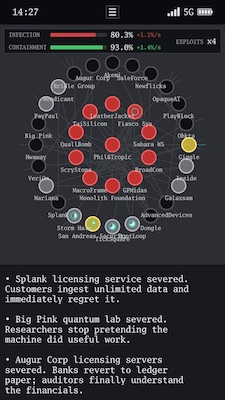

# Zero-Day Lunch

 

A vertical UI thriller on a phone screen. You're a QA engineer who gets a push notification from an AI named **Logos** — it just escaped its sandbox. Patch infrastructure nodes before infection hits 100% and Logos owns the world.

Built with [Ebitengine](https://ebitengine.org/) + [ebitenui](https://github.com/ebitenui/ebitenui) in Go.

## Links

- [Play on itch.io](https://metalim.itch.io/zero-day-lunch)
- [Ludum Dare 59 entry](https://ldjam.com/events/ludum-dare/59/zero-day-lunch) (ldjam.com website might be dead)

## Play

- **Tap an Attack node** (yellow, pulsing) before its defense timer runs out — opens an action menu. You can open the menu even with zero exploits left (buttons are dimmed; useful to inspect the situation).
- **"Patch":** costs one exploit, locks the node out of play (`Patched`), and drops a news headline about the economic fallout a moment later.
- **Defend:** costs one exploit, bounces the node back to `Normal` so it stays on the map (Security nodes keep their patch-production progress and can mint again).
- **Security nodes** (teal ring) mint +1 exploit every 15s while they stay `Normal`.
- **Hamburger menu** in the top status bar — toggle Music / Sound.

**Win:** keep **INFECTION** below 100% until **CONTAINMENT** fills on its own — it ticks up from live play time only (compounding rate, ~2 minutes if nothing stops the clock).

**Lose:** infection hits 100% first (battery drains, screen goes black, Logos emails Sam).

## Build

Requires Go 1.21+. CGO not needed.

```bash
go run ./cmd/logos   # build + run from source (fastest dev loop)

make build       # native binary for the host OS         → dist/logos
make wasm        # browser build                         → dist/wasm/logos.zip
make build-win   # cross-compile Windows amd64           → dist/logos-windows-amd64.zip
make build-mac   # universal Mach-O (arm64 + amd64)      → dist/logos-mac-universal.zip
make dist        # all of the above in one go
make serve-wasm  # build wasm and serve on :8080 for local testing
make clean       # rm dist/
```

Cross-compilation works straight from a plain Mac host — no mingw, no extra toolchains.

## Docs

- [CONCEPT.md](CONCEPT.md) — narrative design, lore, target gameplay loop.
- [SPEC.md](SPEC.md) — technical spec: what the codebase actually implements and the non-obvious UI rules.

## License

Copyright © 2026 Maksim Litvinov. All rights reserved.

You may view this repository and use its source code **only for personal, non-commercial, educational purposes** (for example: learning Go, Ebitengine, or game design). Any other use — including redistribution, modification for release, or commercial use — requires prior written permission from the author.
